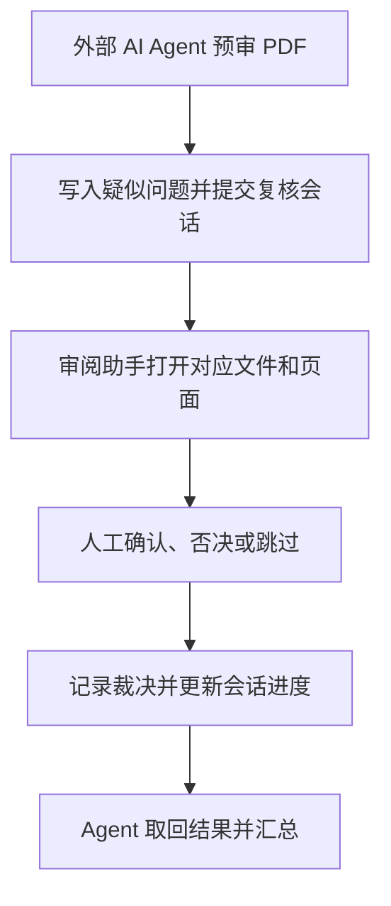

做文档自动化工具时，生成文件只是工作的一部分。排版脚本跑完了，公式处理完成了，最终交付的页面究竟怎么样，仍然需要打开来看。

PDF Review Assistant 就是围绕这个环节做的一个工具。它最初的目的很具体：**配合我们开发的文档处理工具，让人能够快速审阅生成的 PDF，并把发现的问题准确记下来。** 随着这条流程逐渐完整，我们又尝试接入 AI，让它能够提交疑似问题，由人复核，再把判断结果交回自动化流程。

这篇文章想记录的，是这个小工具如何从一个实际需求出发，逐步走向人机协同，以及我们希望通过它验证什么。

## 起点：让发现问题和记录问题连在一起

以教辅文档为例，一批文件经过处理后，你可能需要检查图片是否清晰、页面是否混入广告、文字或公式是否出现渲染异常。即使前面的程序已经做过结构检查，最终页面仍然值得再看一遍。

你发现问题后，通常还要切到表格，填文件名、页码和问题类型，然后回到 PDF 继续翻页。单次操作不复杂，但当文件多、页面多时，这些来回切换会不断打断审阅。

因此，最初的设计就围绕一个动作展开：

**停在问题页 → 按对应快捷键 → 自动记下文件、页码与问题类型 → 继续阅读。**

这个工具配合 SumatraPDF 使用。PDF 阅读器负责显示页面，审阅助手负责记录问题、管理任务和回到问题现场。记录后给出反馈，同时尽量保持你原来的阅读焦点。

后面需要处理问题时，你可以点击记录，重新打开对应文件并跳到那一页。这样，审阅结果就成了一份可以定位、可以交接的问题清单，也能帮助开发者回头检查生成或排版逻辑。

## 先把人工流程做顺，再考虑 AI

快捷键解决了“怎么记”，实际使用还会遇到“记到哪里了”“哪些文件看完了”“误按了怎么办”等问题。

所以工具逐步补上了批次、文件进度、撤销与恢复、问题筛选，以及 CSV、Excel 和批次包导出。它们都服务于同一个目标：让一次审阅可以持续进行，中途能够停下来，之后也能接着处理。

这个过程中，审阅结果从零散笔记变成了结构化记录。每条记录有明确的文件、页码、问题类型和创建者；一批文件也有自己的审阅状态。

这些基础后来成为接入 AI 的条件。**只有人已经能稳定完成的工作流程，才有清晰的位置让 AI 参与。**

放在我们现有的文档工具之间，可以这样理解各自的职责：

| 环节 | 负责的事情 |
| --- | --- |
| Word 排版、MathType 等处理工具 | 生成或调整文档，完成各自的结构与格式检查 |
| PDF Review Assistant | 辅助检查最终页面，把问题定位到具体文件和页码 |
| 开发者或后续处理流程 | 根据问题记录修改源文档、脚本或处理规则，再生成结果复查 |

这是我们希望形成的工作配合。当前审阅助手提供的是问题记录与复核能力，修改上游文档、重新生成 PDF 等动作仍由相应工具和流程承担。

## 接入 AI：让疑点可以被提交和复核

有了这套基础，接下来就可以问：AI 能否先检查一遍，把值得关注的页面交给人？

这里的分工是：外部 AI Agent 读取、分析 PDF，提出疑似问题；审阅助手保存这些疑点，并组织人工复核。**PDF Review Assistant 本身提供协同接口和复核界面，PDF 内容识别与预审能力由接入的 Agent 及其工具承担。**

项目为此提供了 MCP 和命令行接口。对读者来说，关键是 AI 可以通过这些接口创建批次、写入问题标记、提交复核任务，并取回人工判断。

人工和 AI 写入同一套本地记录，但保留各自的身份。AI 提出的疑点进入待复核状态；人直接发现并记录的问题，默认作为自己确认的结果。提出问题的人与作出裁决的人也分别记录。

例如，AI 认为某页存在广告，人打开原页后，可能判断它确实是广告，也可能发现那只是正常的出版信息。工具需要表达这两种结果，让后续流程知道哪些疑点得到确认，哪些被否决。

## 协同的关键：把一组疑点交给人，再取回结果

项目用“复核会话”来组织这次交接。可以把它理解为一份有明确范围和处理状态的待办：AI 提交一组疑点，人逐条判断，完成后 AI 取回结果。

### 人在原页上判断

复核时，程序按问题记录逐条跳页。你查看实际内容，通过快捷键或按钮选择**确认、否决或跳过**，误操作时可以回退。

我们希望把人的注意力留给页面本身。如果每发现一个问题，都要回到聊天窗口解释文件位置、等待回复、再重新打开 PDF，连续审阅就会被对话打断。复核界面直接呈现要看的位置，AI 则通过记录读取你的判断。

这里的“跳过”也需要被正确理解：它表示这次没有给出确定判断，后续仍可能需要处理。当前实现会把跳过计入已处理项，因此**复核会话完成，只代表这组疑点都得到了处理结果，不代表所有问题都已解决，也不等于整批 PDF 已验收通过。**

### AI 能等待，也能继续做别的事

AI 提交会话后，可以查询当前进度，也可以等待人工完成。等待超时时，接口会返回已有的部分结果，方便调用方接着安排后续工作。

这让人工判断有了一个明确的交接点：AI 知道自己提交了什么、还有什么没有处理，以及哪些结果可以拿来汇总。

在外部 Agent 的编排中，还可以把等待交给后台任务或子 Agent，让负责预审的主流程继续检查后面的文件。这是项目文档给出的协同方式，需要由接入方安排执行。

## 两种节奏：边看边协同，或者集中复核

同一套复核机制，可以服务于不同的工作节奏。

| 方式 | 怎么协同 | 想解决的问题 |
| --- | --- | --- |
| 实时协同 | AI 每检查完一个文件，就提交较小的复核会话；人及时处理，AI 取回结果 | 尽早发现判断标准上的偏差，为后续预审提供反馈 |
| 批后复核 | AI 先完成一批预审，再提交会话；人方便时集中处理 | 减少零散打断，让机器处理和人工审阅各自连续进行 |

当前程序会优先展示实时会话，并在新会话到来时通知人工。对于异步流程，项目提供可选的 Webhook：会话或批次完成后，向配置好的接收端发送事件，由外部流程决定接下来做什么。默认情况下，这个通知功能关闭。

我们希望探索的是任务应该怎样分组、何时交给人，才能真正减少总工作量。逐条打断可能太频繁，整批结束后才反馈又可能太晚；更合适的节奏，需要通过实际审阅来判断。

## 更值得探索的，是反馈如何改变下一轮工作

接口打通之后，仍然有几个问题值得继续验证。

### AI 找出的疑点，能否减少人的审阅负担

AI 找到更多疑点，并不一定让审阅更快。误报太多，人就会把时间花在反复否决上。

后续需要观察：不同类型问题中，有多少标记被确认，哪些经常被否决，每条疑点要花多久复核，以及整个批次最终用了多少时间。我们关心的是人完成任务的成本。

### 被否决与被跳过的记录，能否帮助调整判断标准

如果某类正常页眉反复被误判为广告，就可以据此调整预审提示词、规则或示例；如果某类公式渲染问题经常需要跳过，就需要进一步明确检查依据，或者提供更充分的页面信息。

当前工具已经保存标记来源和裁决结果，为这种复盘提供基础。如何整理反馈、评估改动，再用于下一轮预审，仍需要后续流程来完成；它还不是一套自动学习系统。

### AI 没有标出的页面，应该怎样检查

只复核 AI 提交的疑点，可以了解误报情况，却无法直接知道它漏掉了多少问题。

因此，真正验证协同效果时，还需要安排对未标记页面的抽查，或者用一批经过完整人工审阅的样本作对照。这是后续验证方案需要补上的一环，不能仅凭“会话已完成”判断文档质量。

### 问题记录能否帮助改进上游工具

如果问题反复集中在相似的版式或公式上，记录就有机会帮助我们定位生成流程中的共性缺陷。修正脚本后，再生成 PDF 复查，审阅结果就能参与工具开发的迭代。

进一步把“问题记录—工具修改—新版本复查”关联起来，是值得继续探索的方向。目前项目还没有自动修复或跨版本对比能力，这部分需要和上游工具一起设计。

## 目前走到哪一步

截至这篇文章整理时（2026 年 9 月），项目已经实现本地快捷键打标、批次与进度管理、导出和反向跳页；也实现了 MCP / CLI 接口、复核会话、人工裁决界面和可选的完成通知。

仓库的测试记录显示，相关构建与自动化测试已通过。不过，真实业务批次、真实 Agent 接入，以及完整人机协同流程的人工验收仍有待完成。因此，这篇文章记录的是已经落到代码中的方案与正在推进的探索，实际效率提升还需要用真实任务验证。

我们希望这个工具逐渐成为文档工作流里可靠的一环：你能顺畅地看页面、作判断；AI 能把疑点清楚地交过来，并拿着明确的结果继续工作。每一次审阅留下的反馈，也能成为下一次改进工具的依据。

---

项目的使用方式、接口和进展记录，可以继续查看：

- [PDF Review Assistant 项目仓库](https://github.com/LIziak112/PDF_ReviewAssistant)
- [MCP、CLI 与协同流程说明](https://github.com/LIziak112/PDF_ReviewAssistant/blob/main/docs/mcp.md)
- [人机复核实现与验收状态](https://github.com/LIziak112/PDF_ReviewAssistant/blob/main/docs/fr4-status.md)

站内相关实践：[Word 排版](/blog/word-format-skill) · [MathType 公式处理](/blog/mathtype-re-render-skill)。
